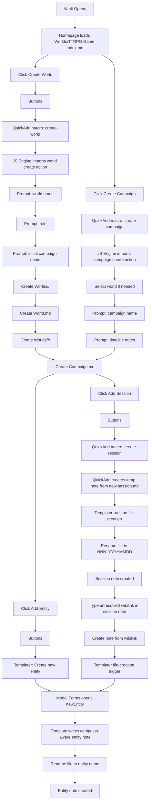

# Obsidian Note Creation SOP

## Purpose

This document describes the current note-creation process used in this vault for:

- creating a new world
- creating a new campaign inside a world
- creating a new session inside a campaign
- creating a new entity from a campaign note
- creating a new entity from a session note
- migrating a legacy pre-separation world into the current structure

It is an operational reference for understanding which plugin is involved, what launches the workflow, and which note structure is produced.

## Related Documents

This SOP is one part of the repo documentation set:

- `README.md` is the public-facing project overview, setup guide, and usage summary.
- `CONTRIBUTING.md` defines contribution and pull request expectations.
- `CHANGELOG.md` records notable user-facing changes.

When a feature changes how worlds, campaigns, sessions, entities, or encounters are created, this SOP should be updated in the same change as the corresponding README and changelog updates.

## Scope

This SOP covers the current vault behavior implemented through:

- `Worlds/TTRPG Game Index.md`
- `_system/templates/new-session.md`
- `_system/templates/new-entity.md`
- `_system/templates/encounter-template.md`
- `_system/scripts/quickadd/createWorld.js`
- `_system/scripts/quickadd/createCampaign.js`
- `_system/scripts/quickadd/createEncounter.js`
- `_system/scripts/actions/world/createWorld.js`
- `_system/scripts/actions/campaign/createCampaign.js`
- `_system/scripts/actions/encounter/createEncounter.js`
- `_system/scripts/actions/migration/migrateLegacyWorld.js`
- `_system/scripts/builders/worldBuilder.js`
- `_system/scripts/builders/campaignBuilder.js`
- `.obsidian/plugins/quickadd/data.json`
- `.obsidian/plugins/templater-obsidian/data.json`
- `.obsidian/plugins/modalforms/data.json`
- `.obsidian/plugins/homepage/data.json`
- `.obsidian/app.json`

## System Overview

The note-creation system is split across two creation engines:

1. `QuickAdd`
   Used for command-driven creation workflows.
   Current creation use cases:
   - world creation
   - campaign creation
   - session creation
   - encounter creation
   - legacy world migration

2. `Templater`
   Used for file-template execution when a new note is created.
   Current creation use cases:
   - session note final shaping after QuickAdd creates a temporary note
   - entity creation

`Modal Forms` is not a primary entry point. It is the structured data capture layer used by the entity and initiative flows.

`Buttons` is the user-facing launcher layer embedded in notes.

`Dataview` and `Bases` are post-creation rendering layers. They do not create notes, but they surface newly created campaigns, sessions, encounters, and entities inside the world and campaign hubs.

`Homepage` makes `Worlds/TTRPG Game Index.md` the startup entry point.

## Current Hierarchy

The vault now uses a three-layer note model:

1. `World`
   Shared setting and reference layer.

2. `Campaign`
   Play hub for one party or timeline inside a world.

3. `Session`
   Sequential play log inside one campaign.

The operational folder structure is:

```text
Worlds/
├── TTRPG Game Index.md
└── <WorldName>/
    ├── World.md
    ├── Ressources/
    └── <CampaignName>/
        ├── Campaign.md
        ├── 001_YYYYMMDD.md
        ├── E0001_Name.md
        ├── EntityName.md
        └── Ressources/
```

## Plugin Responsibility Map

| Plugin | Role in creation flow | Notes |
|---|---|---|
| `Homepage` | Opens the vault on the index note | Startup entry point only |
| `Buttons` | Exposes note-creation actions inside notes | Launches commands from notes |
| `QuickAdd` | Runs macros and template-based creation commands | Used for world, campaign, session, and encounter creation |
| `JS Engine` | Loads modular JS used by QuickAdd script actions | Required by world/campaign/encounter creation |
| `Templater` | Executes file templates on note creation | Critical for sessions and entities |
| `Modal Forms` | Collects structured entity and player-initiative data | Used inside templates and combat flow |
| `Dataview` | Supplies selectable values in forms and renders post-create views | Also powers world/campaign tables |
| `Bases` | Renders campaign knowledge tables | Viewer only, not a creator |

## Entry Points

The active entry points are:

1. Vault startup
   `Homepage` opens `Worlds/TTRPG Game Index.md`.

2. World creation
   `Worlds/TTRPG Game Index.md` contains a `Buttons` block that calls `QuickAdd: create-world`.

3. Campaign creation
   - `Worlds/TTRPG Game Index.md` contains a `Buttons` block that calls `QuickAdd: create-campaign`.
   - Each generated `World.md` also contains an `Add Campaign` button that calls `QuickAdd: create-campaign`.

4. Session creation
   Each generated `Campaign.md` contains a `Buttons` block that calls `QuickAdd: create-session`.

5. Entity creation from a campaign note
   Each generated `Campaign.md` contains a `Buttons` block that calls `Templater: Create new-entity`.

6. Entity creation from a session note
   Creating a new note from an unresolved wikilink inside a campaign/session context triggers the entity template flow.

7. Legacy world migration
   `QuickAdd: prepare-legacy-world-import` stages pasted-image attachments into the legacy world folder, and `QuickAdd: migrate-legacy-world` runs the migration itself.

## SOP: Legacy World Migration

### Trigger

The process starts from a staged legacy world folder inside `_system/migrations/_import/legacy-worlds/`.

The active launcher is:

- `QuickAdd: prepare-legacy-world-import`
- `QuickAdd: migrate-legacy-world`

The trigger chain is:

- `QuickAdd`
- QuickAdd user script: `_system/scripts/quickadd/prepareLegacyWorldImport.js`
- `JS Engine` import of `_system/scripts/actions/migration/prepareLegacyWorldImport.js`
- `QuickAdd`
- QuickAdd user script: `_system/scripts/quickadd/migrateLegacyWorld.js`
- `JS Engine` import of `_system/scripts/actions/migration/migrateLegacyWorld.js`

### Plugin Sequence

1. The user places a legacy world folder in `_system/migrations/_import/legacy-worlds/`.
2. If the staged notes reference pasted images that live in the vault attachment folder, the user runs `QuickAdd: prepare-legacy-world-import`.
3. The prep action:
   - copies linked assets into `<LegacyWorld>/Ressources/`
   - rewrites staged note embeds to `Ressources/...`
   - writes a prep report
4. `QuickAdd` prompts for:
   - source world
   - target world
   - target campaign
   - role
   - timeline notes
   - mode: `Dry Run` or `Apply Migration`
5. The migration action scans the staged world.
6. The action builds a migration plan against the current schema baseline.
7. In dry-run mode, the action writes only a migration report.
8. In apply mode, the action:
   - recreates `World.md`
   - recreates `Campaign.md`
   - migrates legacy notes into the new campaign structure
   - flattens a single top-level legacy campaign folder into the chosen target campaign path when needed
   - copies staged resources
   - writes a migration report
9. Reports are written to `_system/migrations/reports/`.

### Output

Dry-run output:

- one migration report note

Apply output:

- `Worlds/<TargetWorld>/World.md`
- `Worlds/<TargetWorld>/Ressources/`
- `Worlds/<TargetWorld>/<TargetCampaign>/Campaign.md`
- migrated campaign notes and resources
- one migration report note

Preparation output:

- updated staged markdown notes in `_system/migrations/_import/legacy-worlds/<LegacyWorld>/`
- staged copied assets in `_system/migrations/_import/legacy-worlds/<LegacyWorld>/Ressources/`
- one prep report note

## Workflow Diagram



## SOP: New World Creation

### Trigger

The process starts from `Worlds/TTRPG Game Index.md`.

The visible button is:

- `Create World`

The trigger chain is:

- `Buttons`
- `QuickAdd: create-world`
- QuickAdd user script: `_system/scripts/quickadd/createWorld.js`
- `JS Engine` import of `_system/scripts/actions/world/createWorld.js`

### Plugin Sequence

1. `Buttons` exposes the action on the index note.
2. `QuickAdd` launches the macro named `create-world`.
3. The macro runs the user script.
4. The user script delegates execution to `JS Engine`.
5. The world creation action prompts for:
   - world name
   - role: `player` or `dm`
   - initial campaign name
6. The script creates the world folder and `World.md`.
7. The same world creation flow also creates the first campaign folder and `Campaign.md`.
8. The campaign hub is opened at the end of the flow.

### Output

Output paths:

- `Worlds/<WorldName>/`
- `Worlds/<WorldName>/Ressources/`
- `Worlds/<WorldName>/World.md`
- `Worlds/<WorldName>/<CampaignName>/`
- `Worlds/<WorldName>/<CampaignName>/Campaign.md`

### Output Variant

`World.md` now acts as the shared-world reference note. Its structure includes:

- frontmatter with `type`, `world`, `status`, `role`, `system`, `banner`
- `Actions` section with `Add Campaign`
- `Campaigns` section rendered through `Dataview`
- `World knowledge` section limited to notes in the world root folder

### Operational Result

World creation is now a two-note bootstrap:

- one shared world note
- one initial campaign note

This preserves a fast start while cleanly separating setting-level notes from campaign-level play notes.

## SOP: New Campaign Creation

### Trigger

The process starts from either:

- `Worlds/TTRPG Game Index.md`
- a generated `World.md`

The visible buttons are:

- `Create Campaign`
- `Add Campaign`

The trigger chain is:

- `Buttons`
- `QuickAdd: create-campaign`
- QuickAdd user script: `_system/scripts/quickadd/createCampaign.js`
- `JS Engine` import of `_system/scripts/actions/campaign/createCampaign.js`

### Plugin Sequence

1. `Buttons` exposes the action from the index note or a world note.
2. `QuickAdd` launches the macro named `create-campaign`.
3. The macro runs the user script.
4. The user script delegates execution to `JS Engine`.
5. The campaign creation action:
   - infers the world automatically when run from `World.md`, or
   - prompts for world selection when run from the index or elsewhere
6. The action prompts for:
   - campaign name
   - timeline notes
7. The script creates the campaign folder and `Campaign.md`.
8. The campaign hub is opened.

### Output

Output path:

- `Worlds/<WorldName>/<CampaignName>/Campaign.md`

### Output Variant

Each campaign note contains:

- frontmatter:
  - `type: campaign`
  - `world`
  - `campaign`
  - `status`
  - `role`
  - `timelineNotes`
- world backlink
- `Players` section rendered through `dataviewjs`
- `Actions` section with:
  - `Add Session`
  - `Add Entity`
  - `Create Encounter` when role is `dm`
- `Sessions` section rendered through `Dataview`
- `Campaign knowledge` section rendered through `Bases`
- `DM: Encounters` reporting blocks when role is `dm`

### Operational Result

`Campaign.md` is now the control center for active play. It is the launcher for sessions, entities, and encounters, while `World.md` remains the shared-world reference.

## SOP: New Session Creation

### Trigger

The process starts from a generated `Campaign.md`.

The visible button is:

- `Add Session`

The trigger chain is:

- `Buttons`
- `QuickAdd: create-session`
- QuickAdd nested template choice using `_system/templates/new-session.md`
- `Templater` execution on file creation

### Plugin Sequence

1. `Buttons` exposes the action inside `Campaign.md`.
2. `QuickAdd` runs the macro `create-session`.
3. That macro creates a temporary note from `_system/templates/new-session.md`.
4. `Templater` runs on file creation.
5. The template determines `world` and `campaign` from the current folder path.
6. The template scans the current campaign folder for existing session notes.
7. The highest existing numeric prefix is detected.
8. The next session number is incremented.
9. The note is renamed to `NNN_YYYYMMDD`.
10. The note content is generated.
11. If a prior session exists in the same campaign, its `### Session Summary` block is copied into the new note's `### Recap`.

### Output

Output path:

- `Worlds/<WorldName>/<CampaignName>/<NNN>_<YYYYMMDD>.md`

### Output Variant

Each session note contains:

- frontmatter:
  - `type: session`
  - `campaign`
  - `world`
  - `sessionNum`
  - `summary`
  - `location`
  - `date`
- heading: `# Session NNN`
- `### Session Summary`
- `### Recap`
- `### Logs`

Variant behavior:

- if a previous session exists in the same campaign:
  the recap contains a backlink to the previous session and copies that session's summary block

- if no previous session exists:
  the recap contains the placeholder `*No previous session found*`

### Operational Result

The session note is auto-numbered, date-stamped, and campaign-aware through frontmatter. Because it lives in the campaign folder, it is surfaced immediately inside the `Sessions` Dataview table on `Campaign.md`.

## SOP: New Entity Creation From a Campaign Note

### Trigger

The process starts from a generated `Campaign.md`.

The visible button is:

- `Add Entity`

The trigger chain is:

- `Buttons`
- `Templater: Create new-entity`
- `_system/templates/new-entity.md`
- `Modal Forms` form `newEntity`

### Plugin Sequence

1. `Buttons` exposes the action inside `Campaign.md`.
2. `Templater` launches the `new-entity` template as a note-creation command.
3. The template determines the current `world` and `campaign` from the current folder path.
4. The template also tries to detect a source session from the current campaign context.
5. The template opens the `Modal Forms` form named `newEntity`.
6. The form collects common fields and type-specific fields.
7. `Dataview` supplies the selectable values for relationships, filtered to the current campaign context.
8. The template writes frontmatter and body sections based on the selected entity type.
9. The file is renamed to the submitted entity name.

### Output

Output path:

- `Worlds/<WorldName>/<CampaignName>/<EntityName>.md`

### Shared Output Rules

All entity notes share these frontmatter fields:

- `type`
- `date`
- `world`
- `campaign`
- `plane`
- `region`
- `location`
- `description`
- `introducedIn`

The link-oriented fields are written as wikilinks when populated.

### Entity Output Variants

| Entity type | Additional frontmatter | Body variant |
|---|---|---|
| `character` | `faction`, `race`, `gender`, `class`, `playerName`, `alive` | `PC Introduction`, `Additional information` |
| `npc` | `occupation`, `faction`, `race`, `gender`, `class`, `alive` | `NPC Introduction`, `Additional information` |
| `place` | `ruler` | `Location details`, `Local knowledge` Dataview block |
| `store` | `owner` | `Location details` with owner and price point |
| `faction` | `leader` | `Faction summary`, `Faction details` |
| `quest` | `givenBy`, `status` | `Quest summary`, `Quest details` |
| `plane` | none beyond shared fields | `Plane description`, `Planar knowledge` Dataview block |
| `region` | none beyond shared fields | `Region description`, `Regional knowledge` Dataview block |

### Operational Result

The new entity becomes part of the campaign knowledge system because:

- it is created inside the campaign folder
- it carries both `world` and `campaign` frontmatter
- `Campaign.md` contains Dataview and Bases views scoped to that campaign

## SOP: New Entity Creation From a Session Note

### Trigger

This is the session-driven entity path.

The user flow is:

1. while writing a session note, type an unresolved wikilink such as `[[Name]]`
2. create the note from that unresolved link
3. the new file creation triggers the entity template flow

### Trigger Chain

Operationally, this path depends on:

- Obsidian creating the new note in the current campaign context
- `Templater` being configured to run on file creation
- the vault's file-creation trigger applying the entity template at the intended folder level
- `Modal Forms` collecting entity metadata

### Plugin Sequence

1. A new note is created from an unresolved wikilink inside the session context.
2. `Templater` intercepts file creation.
3. `_system/templates/new-entity.md` runs.
4. `Modal Forms` opens `newEntity`.
5. The unresolved link text becomes the starting note title and is used to prefill the entity name when available.
6. If the source note is a session note in the same campaign folder, the template attempts to prefill the entity's `introducedIn` property with that session.
7. The user selects the entity type and fills the relevant fields.
8. The note is rewritten as a proper campaign-aware entity note and renamed to the final entity name.

### Output

Output path:

- `Worlds/<WorldName>/<CampaignName>/<EntityName>.md`

### Output Variant

The final output variant is the same as the campaign-note entity path.

The difference is only the entry point:

- from `Campaign.md`: explicit button-driven creation
- from a session note: implicit note-creation-driven creation

### Operational Result

This path allows a session note to act as a discovery surface. A name can appear in play first, then be promoted into a structured entity note without leaving the campaign context.

## Process Summary By Note Type

| Starting point | User action | Primary plugin chain | Result |
|---|---|---|---|
| `Worlds/TTRPG Game Index.md` | Click `Create World` | `Buttons -> QuickAdd -> JS Engine` | New world folder, `World.md`, and initial `Campaign.md` |
| `Worlds/TTRPG Game Index.md` | Click `Create Campaign` | `Buttons -> QuickAdd -> JS Engine` | New `Campaign.md` inside selected world |
| `Worlds/<WorldName>/World.md` | Click `Add Campaign` | `Buttons -> QuickAdd -> JS Engine` | New `Campaign.md` inside that world |
| `Worlds/<WorldName>/<CampaignName>/Campaign.md` | Click `Add Session` | `Buttons -> QuickAdd -> Templater` | Auto-numbered session note |
| `Worlds/<WorldName>/<CampaignName>/Campaign.md` | Click `Add Entity` | `Buttons -> Templater -> Modal Forms` | Typed entity note |
| `Worlds/<WorldName>/<CampaignName>/<Session>.md` | Create note from unresolved wikilink | `Obsidian -> Templater -> Modal Forms` | Typed entity note |

## Current Design Intent

The vault is now organized around a shared-world model:

1. the index note creates worlds and campaigns
2. each world note tracks shared reference information and lists campaigns
3. each campaign note is the active play hub for sessions, entities, and encounters
4. session notes can still spawn entities organically during play
5. Dataview and Bases turn created files into navigable world and campaign views

In practice:

- `World.md` is the world reference layer
- `Campaign.md` is the campaign control center
- templates and scripts remain the automation layer behind both

## Suggested Next SOP

The next logical companion document would be:

- DM workflow SOP
  covering encounter creation, monster injection, combat start, turn progression, damage, healing, and combat closeout in the campaign-aware structure
