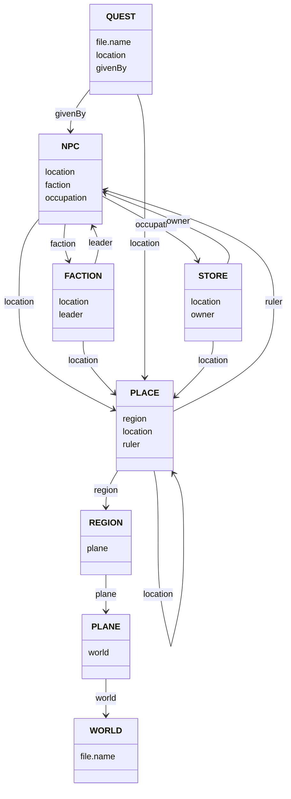

```mermaid
classDiagram
    class NPC {
        location
        faction
        occupation
    }

    class STORE {
        location
        owner
    }

    class PLACE {
        region
        location
        ruler
    }
    
    class FACTION {
        location
        leader
    }

    class REGION {
        plane
    }
    
    class PLANE {
        world
    }
    
    class QUEST {
        file.name
        location
        givenBy
    }
    
    class WORLD {
        file.name
    }

    %% Relationships
    NPC --> STORE : occupation
    NPC --> PLACE : location
    NPC --> FACTION : faction
    FACTION --> NPC : leader
    FACTION --> PLACE : location
    QUEST --> NPC : givenBy
    QUEST --> PLACE : location
    STORE --> NPC : owner
    STORE --> PLACE : location
    PLACE --> REGION : region
    PLACE --> NPC : ruler
    PLACE --> PLACE : location
    REGION --> PLANE : plane
    PLANE --> WORLD : world
```
